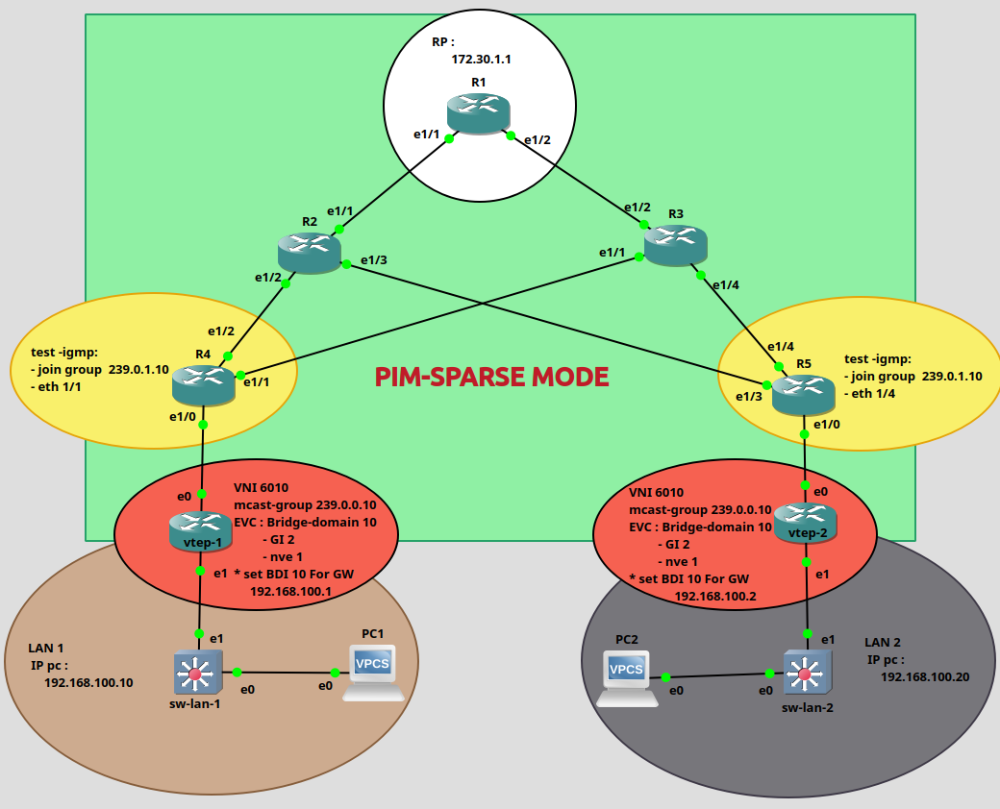

# vxlan-pim-sparse-mode-lab
**Cisco VXLAN Layer 2 Fabric using PIM Sparse Mode, Static RP, IGMP and OSPF Underlay.**

A Cisco VXLAN Layer 2 fabric using PIM Sparse Mode for multicast-based BUM traffic forwarding. The underlay is built with OSPF Area 0, while a static Rendezvous Point (RP) is configured for multicast distribution.

---

## Features

- Layer 2 VXLAN Overlay
- PIM Sparse Mode
- Static Rendezvous Point (RP)
- IGMP
- OSPF Area 0 Underlay
- Ethernet Virtual Circuit (EVC)
- Bridge Domain Interface (BDI)
- Spine-Leaf Architecture
- VTEP Configuration

---

## Topology

---

## Network Design

This lab demonstrates multicast-based VXLAN using PIM Sparse Mode.

OSPF provides the underlay routing, while multicast replication is achieved through PIM Sparse Mode with a statically configured RP. IGMP is used to verify multicast group membership.

---

## Verification

- OSPF Neighbor Adjacency
- PIM Neighbor Establishment
- RP Reachability
- IGMP Group Membership
- NVE Peer Verification
- End-to-End Layer 2 Connectivity

---

## Devices

- 5 Cisco Routers
- 2 Cisco VTEPs
- 2 Access Switches
- 2 VPCS Hosts

---

## How to Use

1. Build the topology in EVE-NG.
2. Apply the configuration files.
3. Verify OSPF neighbors.
4. Verify PIM neighbors.
5. Verify RP operation.
6. Verify IGMP group membership.
7. Test Layer 2 connectivity across VXLAN.

---

## Why PIM Sparse Mode?

This lab demonstrates VXLAN using multicast for BUM traffic forwarding.

Compared to Ingress Replication, multicast-based VXLAN reduces replication overhead by allowing the network to replicate BUM traffic through multicast distribution trees, making it more scalable for larger VXLAN deployments.

## Related Lab

A companion lab implementing VXLAN using Ingress Replication is also available in my GitHub repositories for comparison.

---

## Author

**Sina Sayadi**

Network Engineer | Cisco | SDN | Network Automation

